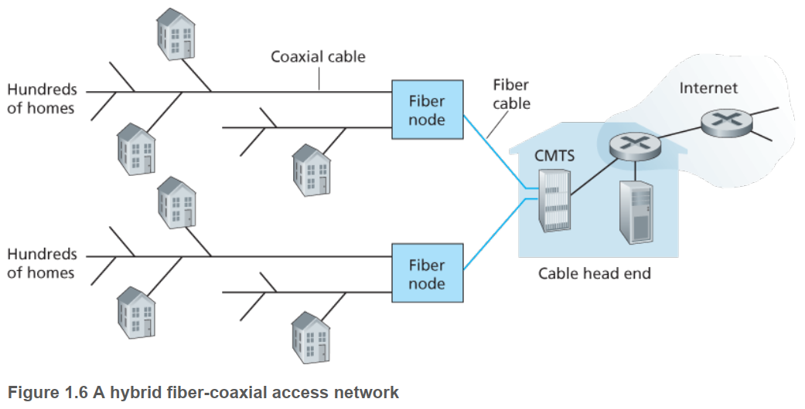
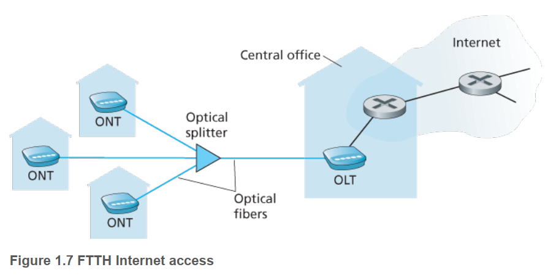
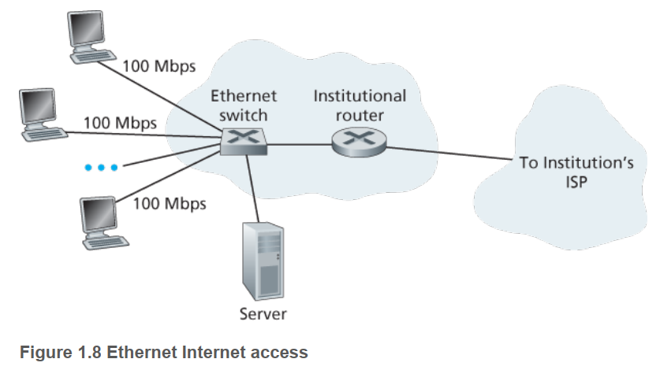
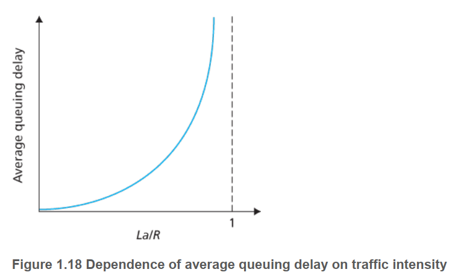
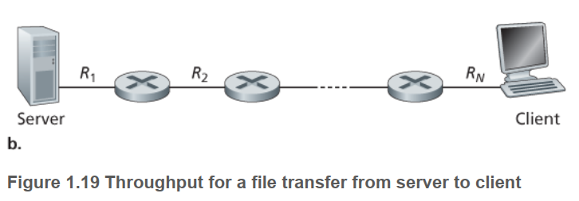
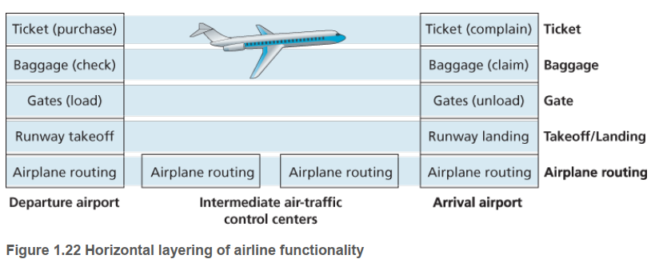
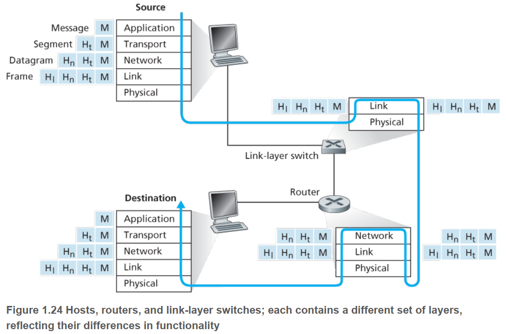

# Chapter 1

[TOC]

## Internet basics

### Components

**Access network.** A type of network that connects subscribers to their immediate service provider.

**Core network.** Connects local providers to one another.

**Host/End systems.** Devices connected to internet.

**Communication link.** Link that connects the hosts.
- Physical media: copper wire, optical fiber, radio spectrum, coaxial cable, etc.
- Transmission rate: bit/sec.

**Packet.** Data segment transferred by end system.
- Header: Bytes added to each segment containing source/destination info.

**Packet switch.** Takes a packet from one of its incoming communication links and forwards to one of its outgoing links.

- Routers: Used in network core.
- Link-layer switches: Used in access networks.

**Route/path.** Sequence of communication links and packet switches traversed by a packet from the sending end system to receiving end system.

**Internet Service Providers (ISP).** Provides network access to end systems.
- Is itself a network of packet switches and communication links.
- Types: Residential ISP, corporate ISP, university ISP, etc.
- Types of access: Cable modem, local area network (LAN), mobile wireless access.
- Each ISP network is managed independently and runs the IP protocol.

### Protocols

**Protocol.** Defines the format and order of messages exchanged between two or more communicating entities, as well as the actions taken on the transmission/receipt of a message or other event.
- All internet activity that involves two or more communicating remote entities is governed by a protocol.
- Different protocols are used in different communication tasks.

**Transmission Control Protocol (TCP).** Controls the sending and receiving of information.

**Internet Protocol (IP).** Specifies the format of the packets sent/received among routers and end systems.

**Hypertext Transfer Protocol (HTTP).** Application layer protocol for distributed, collaborative, hypermedia information systems.

**Simple Mail Transfer Protocol (SMTP).** A communication protocol for electronic mail transmission.

### Services

**Socket interface.** Rules the sending program must follow so that the internet can deliver data to the destination program.

## Network Edge

**Host/End system.** Devices that sit at the edge of the internet, running (hosting) application programs.
- Clients: Desktops, laptops, smartphones, etc.
- Servers: Web servers, email servers, etc.

### Access Networks

**Access networks.** Network that physically connects an end system to the first router (edge router) on a path from the end system to any other distant end system.

#### Home Access

**DSL (digital subscriber line).** Internet access from the same telco (telephone company) that provides wired local phone access.
- Uses existing telephone line (twisted-pair copper wire).
- Frequency-division multiplexing: Uses different frequency than telephone signal channel to transmit digital signals (a telephone call and an internet connection can share the DSL link at the same time).
- Bandwidth
  - Dedicated.
  - Asymmetric: Downstream 12 Mbps and upstream 1.8 Mbps, or downstream 55 Mbps and upstream 15 Mbps.

**Asymmetric access.** Downstream and upstream rates are different.

**Cable.** Internet access from the same cable TV company that provides cable TV.

- Uses Optical fiber, coaxial cable (hybrid fiber coax, or HFC).
- Uses cable modem.
- Bandwidth
  - Shared broadcast medium.
  - Asymmetric: Downstream <= 42.8 Mbps, upstream <= 30.7 Mbps.

**FTTH (fiber to the home).** Optical fiber path from the central office (CO) directly to the home.
- Optical distribution from CO to home.
- Direct fiber: One fiber from CO for each home.
- Split fiber: Many homes share fiber from CO, which then splits into different fiber.
    - Active optical network (switched Ethernet)
    - Passive optical network
- Bandwidth
    - Dedicated.
    - 20 Mbps.

**Dial-Up.** A home modem connects to ISP modem over a phone line.
- Same model as DSL.
- Bandwidth
  - Dedicated.
  - Very slow, 56kbps.

**Satellite link.**

#### Enterprise (and Home) Access

**Local area network (LAN).** Used to connect an end system to the edge router.

**Ethernet.** Most prevalent LAN access technology.
- Users use twisted-pair copper wire to connect to Ethernet switch, which is connected to a router, which connects to the ISP.

**Wireless LAN.** Wireless connection to LAN.
- Users transmit/receive packets to/from an access point connected into the enterprise’s network (using wired Ethernet).
- User needs to be within tens of meters from access point.

**WiFi.** A Wireless LAN access based on certain IEEE technology.

#### Wide-Area Wireless Access

* Users transmit/receive packets to/from base station operated by cellular network provider.
* User needs to be within tens of kilometers from base station.

**3G/4G.** Third/fourth-generation packet-switched wide-area wireless access at > 1Mbps.

**LTE.** Long-term evolution, over 10Mbps.

### Physical Media

**Guided media.** Bit sent by propagating electromagnetic waves or optical pulses across a solid medium.
- Optic fiber
- Copper wire
- Coaxial cable

**Unguided media.** Bit sent by waves propagating in the atmosphere and outer space.
- Wireless LAN
- Digital satellite channel

| Media                      | Composition                                                                 | Usage                                                                           |
|----------------------------|-----------------------------------------------------------------------------|---------------------------------------------------------------------------------|
| Twisted-pair copper wire   | Two copper wires twisted to reduce electrical interference from other wires | Telephone network, LAN                                                          |
| Coaxial cable              | Two concentric copper conductors                                            | Cable TV                                                                        |
| Fiber optics               | Conduct light pulses, each pulse is a bit                                   |                                                                                 |
| Terrestrial radio channels | Electromagnetic spectrum                                                    | Short distance: Wireless keyboards, local-area: LAN, Wide-area: Cellular access |
| Satellite radio channels   | Links earth-based microwave ground stations                                 | Geostationary satellites, Low-earth orbiting satellites                         |

## Network Core

### Packet Switching

Resources are not reserved but used on demand.

* Simpler, less costly to implement.
* Better sharing of transmission capacity (no wasteful idle periods).
* May have unpredictable end-to-end delays.
* Trend.

**Store-and-forward transmission.** The packet switch must receive the entire packet before it starts transmitting.

**Output queue.** A packet switch link’s output buffer which stores packets that the router is about to send into that link.

**Queuing delay.** Time a packet spends waiting in the output buffer before being transmitted.

**Packet loss.** When an output queue is full, the arriving packet or one of the already-queued packet would be dropped.

**IP address.** An end system’s address in the internet.

- Included in the packet’s header.
- Hierarchical, like postal address.

**Forwarding table.** Router maps destination addresses to its outbound links.
- Set by routing protocols automatically.

### Circuit Switching

Resources needed along a path (buffers, link transmission rate) are received for the duration of the communication session (like telephone lines).
- Dedicated circuits may be idle ("wasted"). E.g., even if a user may be active only 10% of the time, the bandwidth must be reserved at all times.
- More stable.

**Frequency-division multiplexing (FDM).** Frequency spectrum of a link is divided up among circuits. Each circuit gets a frequency band.

* Requires sophisticated analog hardware to shift signal into appropriate frequency bands.

**Time-division multiplexing (TDM).** Time is divided into revolving frames of fixed duration. Each frame is divided into fixed number of slots. Each circuit gets a time slot in each frame.

- E.g., 8000 frames/second, each slot has 8 bits, then transmission rate is 8000*8=64kbps.

## Network of Networks

**Access ISP.** Connect end systems into the Internet.

- Wired or wireless
- DSL, cable, FTTH, Wi-Fi, cellular.
- Telephone/cable company, university, company

**Points of presence.** A group of routers in the provider’s network where customer ISPs can connect into the provider ISP.

**Multi-home.** One access ISP connects with multiple regional/tier 1 ISPs.

**Peer.** A pair of nearby ISPs at the same level of hierarchy directly connect their networks.

**Internet Exchange Point (IXP).** A meeting point where multiple ISPs can peer together.

**Content-provider networks.** Like Google.
- May have own private networks.

### Packet-Switched Network

#### Delay

**Nodal processing delay.** Time required to examine the packet’s header and determine where to direct the packet.
- Microseconds

**Queuing delay.** Time the packet spends waiting to be transmitted onto the link.
- Related to the traffic arriving at the queue.
- Can vary from packet to packet. Usually characterized statistically, e.g., average queuing delay.

**Traffic intensity.** If $a$ is the average rate at which packets arrive at queue (packets/sec), $R$ is transmission rate (bits/sec), and all packets have $L$ bits, then $La/R$ , ratio between the average rate at which bits arrive at the queue and the transmission rate, is the traffic intensity.

* If $La/R>1$, queue grows.
* If $La/R\leq 1$, queuing delay depends on whether traffic comes in bursts or is spread out evenly. 
  * If $N$ packets arrive simultaneously every $(L/R)N$ seconds, then the average queuing delay is $0 + \frac{L}{R} + \frac{2L}{R} + \cdots + \frac{(N-1)L}{R} = \frac{N(N-1)}{2}\frac{L}{R}$ seconds.

**Transmission delay.** Time required to push all the packet’s bits into the link.
- Number of bits in packet / link transmission rate.
- Microseconds to milliseconds.

**Propagation delay.** Time required to propagate from the beginning of the link to the next router.
- Depends on the link’s physical medium.
- Distance between the two routers / propagation speed (close to the speed of light).
- Milliseconds.

**Media packetization delay.** In Voice-over-IP (VoIP) applications, the time the sending side takes to fill a packet with digitized speech before passing it to the internet.

* Impacts the quality of VoIP call.

#### Packet Loss

If a packet arrives at a full queue, it will be dropped by the router.

Node performance = delay + packet loss.

#### Throughput

Suppose Host A sends a large file consisting of $F$ bits to Host B over $T$ seconds.

**Instantaneous throughput.** Rate (bits/sec) at which Host B is receiving the file at any instant of time.

**Average throughput.** $F/T$ bits/sec.

Suppose a client connects to a server via an $N$-link (linear) network ,the throughput is $\min{R_1, R_2, \ldots, R_N}$, i.e., transmission rate of the bottleneck link.

Constraining factor for throughput is access network.

Throughput depends on:

1. Minimum transmission rate among all links in the path.
2. Traffic.

## Protocol Layers

Each layer provides service by 

1. Performing actions within that layer, and
2. Using services of the layer directly below it.

**Protocol layering.** Each protocol belongs to a layer.

* A layer may be implemented in software (application-layer, transport-layer) or hardware, or both (network-layer).

**Service model.** Services a layer offered to the layer above.

**Internet protocol stack.** Physical, link, network, transport, application layers.

| Layer       | Description                                                  | Protocols                                                    | Packet                                                       |
| ----------- | ------------------------------------------------------------ | ------------------------------------------------------------ | ------------------------------------------------------------ |
| Application | Network application endpoints.                               | HTTP: Web document request and transfer SMTP: Email transfer FTP: File transfer DNS (domain name system): Translate human readable internet address to 32-bit network address | Message                                                      |
| Transport   | Transports application-layer messages between application endpoints. | TCP (transmission control): Connection-oriented  * Guaranteed delivery of application-layer messages  * Flow control (sender/receiver speed matching)  * Congestion control  UDP (user data): Connectionless  * No guarantee, flow control, or congestion control | Segment Encapsulates application-layer message with transport-layer header. |
| Network     | Moves transport-layer segment from one host to another (e.g., machines that host the applications). | IP: Defines fields in the datagram and how end systems/routers act on these fields. Routing protocols: Determines routes datagrams take. | Datagram Encapsulates transport-layer segment with network-layer header. |
| Link        | Moves datagram from one node to the next node in the route.  (Datagram may be handled by different protocols at different links) | Ethernet, WiFi.                                              | Frame Encapsulates network-layer datagram with link-layer header. |
| Physical    | Moves individual bits in a frame from one node to the next.  | Depends on link medium (twisted copper write, fiber optics, etc) |                                                              |

## Network Attacks

**Botnet.** A network of devices compromised by malware.

**Virus.** Malware that require some user interaction to infect the device.

**Worm.** Malware that do not require user interaction to infect the device.

**Denial-of-service (DoS) attacks.** Makes a network unusable by legitimate users.

* Vulnerability attack: If the right sequence of packets is sent to a vulnerable application, the service can stop or the host can crash.
* Bandwidth flooding: Attacker sends a deluge of bogus packets so that the target host can't receive legitimate packets.
* Connection flooding: Attacker establishes a large number of bogus TCP connections at the target host so that the host stops accepting legitimate connections.

**Distributed DoS (DDoS) attack.**  Blast target host from multiple compromised hosts in botnet.

* Harder to detect and defend against than DoS attack from single host.

**Packet sniffer.** A passive receiver that records a copy of every packet that flies by.

**IP spoofing.** Inject packets into the internet with a false source address (pose as another user).

**End-point authentication.**  A mechanism that allows us to determine if a message originates from where we think it does.