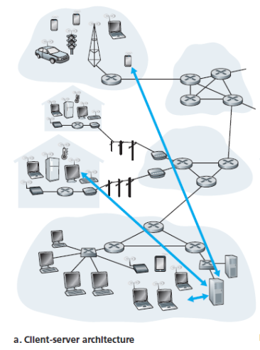

# Chapter 2

### Principles of Network Applications

#### Network Application Architectures

**Client-server architecture.** Always-on server host communicates with other client hosts.

* Clients don't directly communicate.
* Server has a fixed IP address.
* Example applications: Web, FTP, Telnet, e-mail.

**Data center.** Place to put many hosts together and create a powerful virtual server.

**Peer-to-peer (P2P) architecture.** No dedicated server, replies on direct communication between pairs of connected hosts (peers).

* Example applications: File sharing (BitTorrent, self-scalability), peer-assisted download acceleration (Xunlei), Skype.

Mixed architecture: Instant messaging applications.

### Processes

How processes running on different hosts communicate.

A network application consists of pairs of (client and server) processes that send messages to each other over network:

| Application      | Server                  | Client                    |
| ---------------- | ----------------------- | ------------------------- |
| Web              | Web server              | Web browser               |
| P2P file sharing | Host uploading the file | Host downloading the file |

**Client process.** The process that initiates the communication (contacts the other process to initiate comm session).

**Server process.** The process that waits to be contacted.

