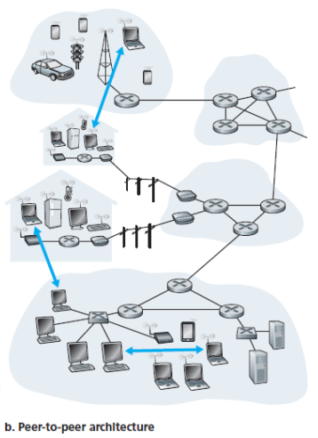

# Chapter 2

### Principles of Network Applications

#### Network Application Architectures

**Client-server architecture.** Always-on server host communicates with other client hosts.

* Clients don't directly communicate.
* Server has a fixed IP address.
* Example applications: Web, FTP, Telnet, e-mail.

**Data center.** Place to put many hosts together and create a powerful virtual server.

**Peer-to-peer (P2P) architecture.** No dedicated server, replies on direct communication between pairs of connected hosts (peers).

* Example applications: File sharing (BitTorrent, self-scalability), peer-assisted download acceleration (Xunlei), Skype.

Mixed architecture: Instant messaging applications.

### Processes

How processes running on different hosts communicate.

A network application consists of pairs of (client and server) processes that send messages to each other over network:

| Application      | Server                  | Client                    |
| ---------------- | ----------------------- | ------------------------- |
| Web              | Web server              | Web browser               |
| P2P file sharing | Host uploading the file | Host downloading the file |

**Client process.** The process that initiates the communication (contacts the other process to initiate comm session).

**Server process.** The process that waits to be contacted.

**Socket.** Software interface (API) between process and computer network (transport-layer protocol).

#### Addresses

To send message to a process, we need 

1. the IP address of the destination host, and 
2. a port number that identifies the receiving process.

**IP address.** A 32-bit quantity that uniquely identifies the host.

**Port number.** Identifier for the receiving process on the destination host.

* E.g., web server - port 80, mail server - port 25.

### Transport Services

#### For Applications

When developing application, need to choose transport-layer protocols, like choosing train/airplane to travel.

| Service                | Description                                                  | Application                                                  |
| ---------------------- | ------------------------------------------------------------ | ------------------------------------------------------------ |
| Reliable data transfer | Guaranteed data delivery from one process to another.        | Email, bank transactions. As opposed to loss-tolerant applications (conversational audio/video). |
| Throughput             | Guaranteed available throughput at specified rate.           | Bandwidth-sensitive applications, e.g., telephone. As opposed to elastic applications (email, file transfer) that can make use of as little throughput as available. |
| Timing                 | Guaranteed data arrival within specified time limit after sending. | Interactive real-time applications (internet telephony, teleconferencing, multiplayer games). |
| Security               | Confidentiality between two processes, even if the data is observed during transfer. E.g., encryption/decryption, data integrity, end-point authentication. | Messenger                                                    |

#### Provided by the Internet

